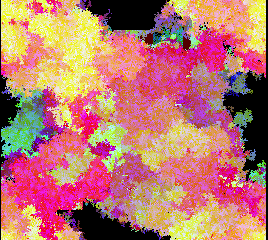

# C Example: fungus

`make`

Fluidly expanding colors and grumbling sound. Draws to the framebuffer with an organic growth mechanism based on replicating agents.

## Controls

| Button | Functionality                                          |
| ------ | ------------------------------------------------------ |
| D-Pad  | Move agents in that direction                          |
| A      | Increases the rate at which the color cycles           |
| B      | Select between 3 growth speeds                         |
| X      | Toggle super grow mode, causing agents to grow outward |
| Y      | Toggle whether some agents/all agents draw to screen   |
| L,R    | Cycle colors                                           |
| Select | Pause                                                  |
| Start  | System reset                                           |

## Suggestions

Notes from Andi:

If you're just running the app, some things I like doing are:

- On boot immediately hit X and A
- On boot immediately hit Y and B
- Touch nothing, and just wait until the fungus starts consuming the pillars
- Go in any mode and hold down and right.

If you're using this as sample code: This app demonstrates several different features of the Pocket RISC-V core.

* It draws to the framebuffer;
* It plays sound;
* It uses gamepad controls (look for `cont1_key`);
* It can reset the system (look for `face_start`);
* It checks the system time, to seed RNG (look for `xo_seed`).

You can delete basically all of this, but you'll want to keep the basic structure: Your app should be one big loop, the loop should begin by spinning until `apf_video_video_vblank_triggered_extract` goes high, and you want to draw first, refill your audio buffers second and execute your logic third (so that you get visuals drawn before VBLANK ends, and audio submitted before the buffer runs dry).

If you want to try improving the example as written, some fun things to try might be:

* Improve the color cycling. The current color scheme is kind of ugly!
* "Super grow mode" was intended to make the fungus grow outward in organic, concentric shapes like tree rings, but even in super grow mode the agents tend to just sorta to spin in place. Maybe you can do better?
* The audio was supposed to sound like a kind of rustling squeaking noise because I thought that was what growing fungus might sound like, but it wound up kind of more like a burbling cauldron. Again, maybe you can do better than I could? (Remember: Never test new audio code with headphones on! Clipping is easy to do by accident and will produce the most painful sound you've ever heard.)
* Could you make a two player game with two blobs of fungi trying to consume each other?

## License

This sample is written by [Andi McClure](https://pocket.runhello.com/). It is available under [Creative Commons Zero](https://creativecommons.org/publicdomain/zero/1.0/legalcode), in other words, it is public domain. If you substantially reuse the code, a credit would be appreciated, but this is not legally required.
