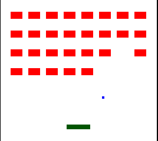

# Rust Example: minibreak

`make minibreak`

A difficult Breakout clone implementating diff framebuffer updates.

## Controls

| Button     | Functionality |
| ---------- | ------------- |
| Left/Right | Move paddle   |
| Select     | Pause         |
| Start      | System reset  |

## License

This code is licensed CC0.