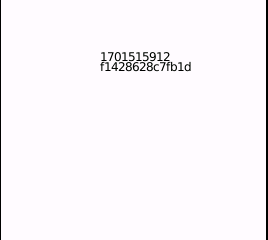

# Rust Example: rtc_id

`make rtc`

Displays the current, incrementing Unix time (in seconds) from the RTC data provided by the Pocket, alongside the unique Cyclone V chip ID (usable as a unique identifier between devices). UI is rendered via Slint, and this example provides a simple starting setup for drawing a UI.

## License

This code is dual licensed MIT and GPLv3. As this example contains Slint, it must be licensed as GPLv3 to satisfy that license.